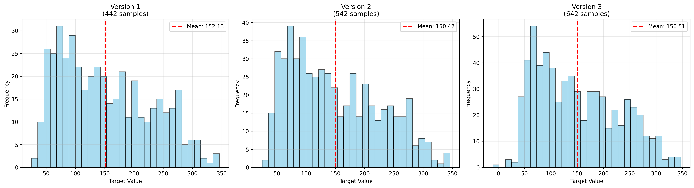
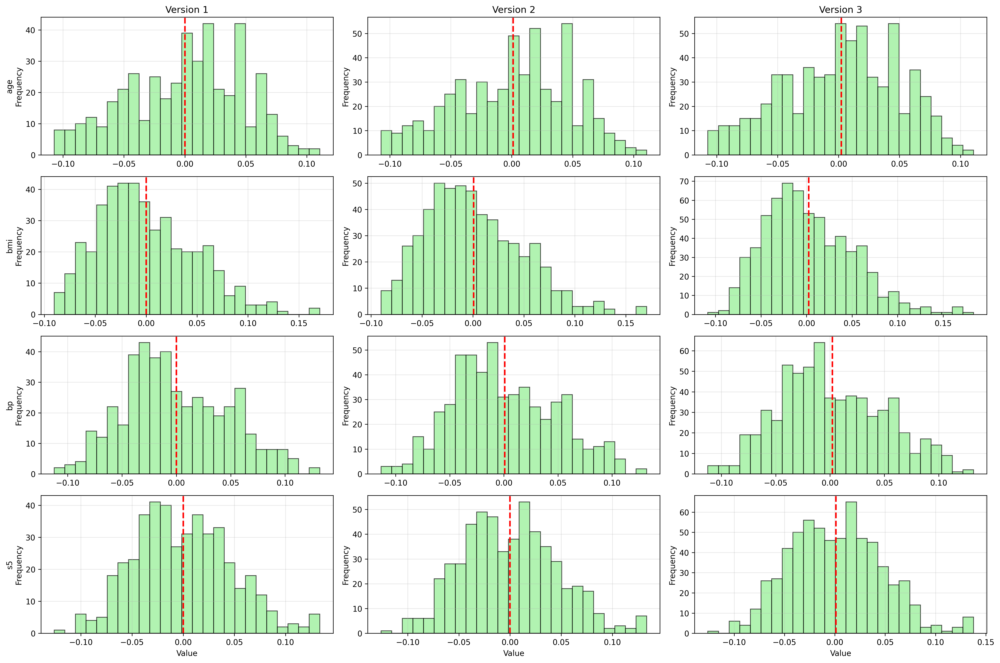
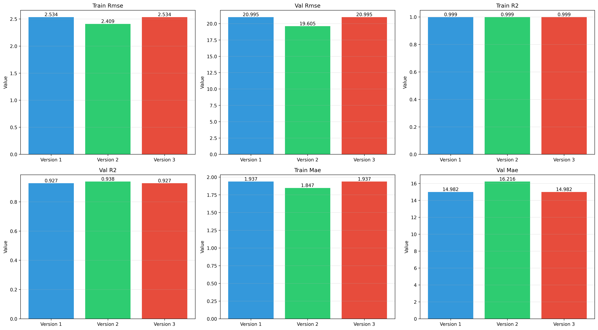

# Rapport de Comparaison - Versions du Dataset Diabetes

## Statistiques des Datasets

| Métrique | Version 1 | Version 2 | Version 3 |
|----------|-----------|-----------|-----------|
| Nombre d'échantillons | 442 | 542 | 642 |
| Target - Moyenne | 152.13 | 150.42 | 150.51 |
| Target - Écart-type | 77.09 | 76.80 | 78.02 |
| Target - Min | 25.00 | 25.00 | -10.18 |
| Target - Max | 346.00 | 346.00 | 346.87 |

## Visualisations

### Distributions de la Target

### Distributions des Features

## Performance des Modèles

### Métriques Détaillées

| Métrique | Version 1 | Version 2 | Version 3 |
|----------|-----------|-----------|-----------|
| val_rmse | 20.9948 | 19.6045 | 20.9948 |
| val_r2 | 0.9267 | 0.9383 | 0.9267 |
| val_mae | 14.9820 | 16.2158 | 14.9820 |